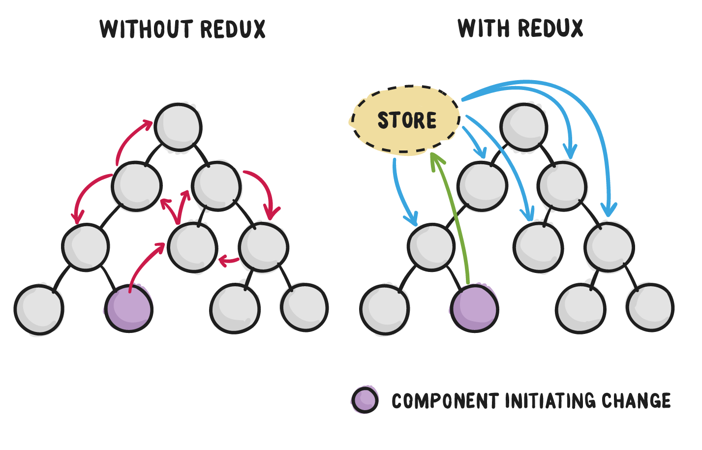
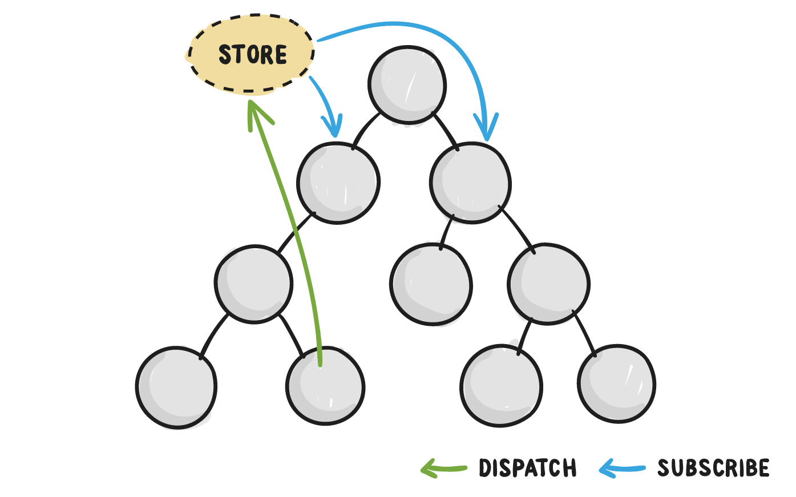
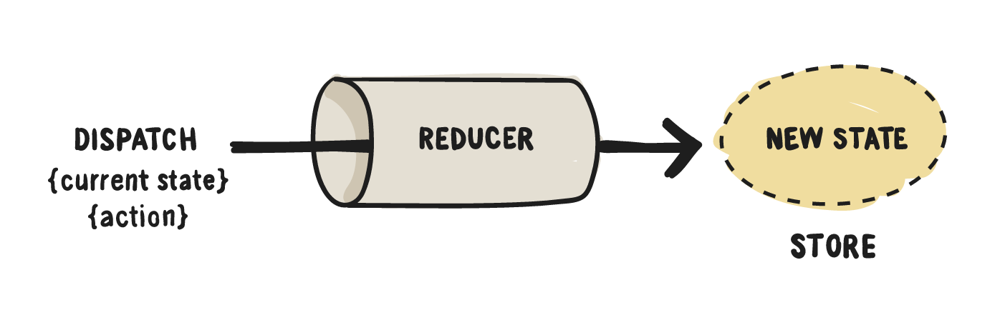
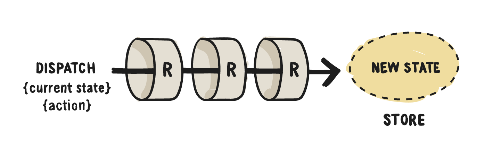

# High Level React


---

# The Ecosystem


---

# React
## The view layer


---

# Redux
## The data layer


---

# Babel
## The transpiler


---

# Webpack
## The code bundler


---

# Features of React

- Components
- Props 
- Lifecycle
- JSX


---

# Components

## The building blocks of react


---

```javascript
// Stateless Functional Component
const MyComponent = () => {
    return (
        <div>Hi</div> // JSX
    );
};

// Class Component
class MyComponent extends React.Component {
    render() { // render lifecycle method
        return (
            <div>Hi</div> // JSX
        )
    }
}
```

---

## Stateless Functional Components

- A function that returns JSX
- No access lifecycle methods
- No access to component `state`
- Simplest implementation of a component


---

```javascript
const MyComponent = () => { // Stateless Functional Component
    return (
        <div>Hi</div> // JSX
    );
};
```

---

## Class Component

- A `class` with the the `render()` method which returns JSX
- Has access to lifecycle methods and `this.state`


---

## Components are instantiated the same in JSX

```
<div>
  ...
  <MyComponent /> // display MyComponent
  ...
</div>
```

---

## Compents recieve data through props

```
<MyComponent prop1={myData} prop2={myOtherData} />
```

---

## Components access props

```javascript
const MyComponent = (props) => {
    return (
        <div>{props.hi}</div>
    );
};

class MyComponent extends React.Component {
    render() {
        return (
            <div>{this.props.hi}</div>
        )
    }
}
```

---

## Component Lifecycle

### Mounting
- `constructor()`
- `componentWillMount()`
- `render()`
- `componentDidMount()`


---

# Lifecycle continued

## Updating
- `componentWillReceiveProps()`
- `shouldComponentUpdate()`
- `componentWillUpdate()`
- `render()`
- `componentDidUpdate()`


---

## JSX

- Available to all components
- Adds XML syntax to JavaScript
- Is transpiled into JavaScript at build time
- Not required


---

```html
<div>
    <MyComponent
        onClick={(e) => { // event handlers
            e.preventDefault()
        }}
        style={{ // inline styling
            color: 'red'
        }}
        className='important' // CSS classes
        myValue={foo ? 'fizz' : 'buzz'} // props
    />
</div>
```

---

# Redux
## The data layer


---



---

# Features

- Single source of state
- Unidirectional data flow
- Library to integrate with React


---

- Actions
- Reducers
- Store
- Data flow
- Working with React


---

## Actions

- Actions are payloads of information that send data from your application to your store.
- Actions are plain javascript objects with a type key


---



---

```javascript
const ADD_TODO = 'ADD_TODO'
{
  type: ADD_TODO,
  text: 'Build my first Redux app'
}
```

---

## Reducers

- Reducers recieve actions and update app state
- State is stored in a single object


---



---

## How Reducers work

```javascript
function myReducer(state, action) {
    switch (action.type) {
        case ADD_TODO:
            return { //new state
                data: action.payload
            };
        default:
            return {
                ...state
            }
    }
}
```

---

# Store

- Holds app state
- Allows access to state through `getState()`
- Allows state to be updated through `dispatch(action)`
- Registers listeners through `subscribe(listener)`
- Handles unregestering of listeners through function returned by `subscribe(listener)`


---

- `state` is read only
- Redux apps have a single store
- Complexity is handled through reducer composition


---

  "The shape of the state is up to you:
  it can be a primitive, an array, an object, 
  or even an Immutable.js data structure. The 
  only important part is that you should not 
  mutate the state object, but return a new 
  object if the state changes." 
  -- Redux docs


---

# Data Flow


---

# Step 1: call `dispatch(action)`

```javascript
dispatch({ type: MY_ACTION, payload: {mydata}});

or

const action = (data) => {
    return {
        type: MY_ACTION,
        payload: data
    };
};

dispatch(action(data));
```

---

# Step 2: Redux store calls the reducer function

- Store passes the current state tree and action to the reducers.
- Reducer only computes next state.
- Reducers are pure function functions.


---

```javascript
 // The current application state (list of todos and chosen filter)
 let previousState = {
   visibleTodoFilter: 'SHOW_ALL',
   todos: [ 
     {
       text: 'Read the docs.',
       complete: false
     }
   ]
 }

 // The action being performed (adding a todo)
 let action = {
   type: 'ADD_TODO',
   text: 'Understand the flow.'
 }

 // Your reducer returns the next application state
 let nextState = todoApp(previousState, action)
```

---

# Step 3: Root reducer may combine output of multiple reducers into a single state tree

- Using `combineReducers()`, redux passes action through all reducers
- Returns a single state tree


---



---

```javascript
 function todos(state = [], action) {
   // Somehow calculate it...
   return nextState
 }

 function visibleTodoFilter(state = 'SHOW_ALL', action) {
   // Somehow calculate it...
   return nextState
 }

 let todoApp = combineReducers({
   todos,
   visibleTodoFilter
 })
```

---

```javascript
 let nextTodos = todos(state.todos, action)
 let nextVisibleTodoFilter = visibleTodoFilter(state.visibleTodoFilter, action)

return { // return value of combineReducers
   todos: nextTodos,
   visibleTodoFilter: nextVisibleTodoFilter
 }
```

---

# Step 4: Redux store saves complete state tree returned by reducer

- This is new state tree is the state of your app.

---

# React + Redux
## Using `react-redux` library


---

## Giving Components Access to the App State

- Data is passed to React components through 'container' components.
- Container components are generally HOC's (higher order components) created by the `connect` function
- Container components have direct access to the redux store via the `mapStateToProps` argument.


---

```javascript
import {connect} from 'react-redux';

const MyComponent = (props) => {
    return (
        <div>
            {props.prop1}
            <OtherComponent value={props.prop2} />
        </div>
    );
};

const mapStateToProps = (state) => {
    return {
        prop1: state.thing1,
        prop2: state.thing2
    }
}

export default connect(mapStateToProps)(MyComponent);
```

---

## Giving Componets Access to Dispatch Actions

- Actions can be imported where needed, but cannot be called without `store.dispatch`.
- Container components get access to dispatch actions through the `mapDispatchToProps` argument of the `connect` function.


---

```javascript
import {connect} from 'react-redux';
import {action1} from '../modules/foo';
import {action2} from '../modules/bar';

const MyComponent = (props) => {
    return (
        <div
            onClick={props.prop1}
            onBlur={props.prop2}
        >
            ...
        </div>
    );
};

const mapDispatchToProps = {
    prop1: action1,
    prop2: action2
}

export default connect(null, mapDispatchToProps)(MyComponent);
```

---

## Now you have a fully working React ecosystem
### Go and build!


